# AutoShop Pro — Architecture Guide

> Complete architecture documentation with Mermaid diagrams.
> Suitable for onboarding engineers and presenting to technical stakeholders.

---

## Table of Contents

1. [High-Level Architecture](#1-high-level-architecture)
2. [System Architecture Diagram](#2-system-architecture-diagram)
3. [Frontend Architecture](#3-frontend-architecture)
4. [Backend Architecture](#4-backend-architecture)
5. [Database Architecture](#5-database-architecture)
6. [Database ERD](#6-database-erd)
7. [Authentication Architecture](#7-authentication-architecture)
8. [Authentication Flow Diagram](#8-authentication-flow-diagram)
9. [Authorization Architecture](#9-authorization-architecture)
10. [Offline Sync Architecture](#10-offline-sync-architecture)
11. [API Flow Diagram](#11-api-flow-diagram)
12. [Subscription Architecture](#12-subscription-architecture)
13. [Payment Journey Diagram](#13-payment-journey-diagram)
14. [User Journey Diagram](#14-user-journey-diagram)
15. [Admin Journey Diagram](#15-admin-journey-diagram)
16. [Deployment Architecture](#16-deployment-architecture)

---

## 1. High-Level Architecture

AutoShop Pro follows a **client-heavy, offline-first architecture**. The frontend handles most business logic locally with IndexedDB, while Supabase acts as the authoritative remote database. The system is designed so the app remains fully functional without internet connectivity.

```
┌─────────────────────────────────────────────────────────────────┐
│                         CLIENT (Browser)                        │
│                                                                 │
│  Next.js 16 App Router                                         │
│  ┌──────────┐  ┌──────────┐  ┌───────────┐  ┌─────────────┐  │
│  │  React   │  │ TanStack │  │  Zustand  │  │    Dexie    │  │
│  │  19 UI   │  │  Query   │  │   Store   │  │  IndexedDB  │  │
│  └──────────┘  └──────────┘  └───────────┘  └─────────────┘  │
│        │             │              │               │          │
│        └─────────────┴──────────────┴───────────────┘         │
│                              │                                  │
│                    ┌─────────▼──────────┐                      │
│                    │   Service Worker   │                      │
│                    │ (Offline fallback) │                      │
│                    └─────────┬──────────┘                      │
└──────────────────────────────┼──────────────────────────────────┘
                               │ HTTPS
                ┌──────────────▼───────────────┐
                │         Vercel Edge          │
                │   Next.js Proxy (proxy.ts)   │
                │   API Routes (/api/*)        │
                └──────────────┬───────────────┘
                               │
                ┌──────────────▼───────────────┐
                │           Supabase           │
                │  ┌──────────┐  ┌──────────┐  │
                │  │ Auth API │  │   REST   │  │
                │  │  (JWT)   │  │   API    │  │
                │  └──────────┘  └──────────┘  │
                │  ┌────────────────────────┐  │
                │  │  PostgreSQL + RLS      │  │
                │  │  RPCs (business logic) │  │
                │  │  pg_cron (background)  │  │
                │  └────────────────────────┘  │
                └──────────────────────────────┘
```

---

## 2. System Architecture Diagram

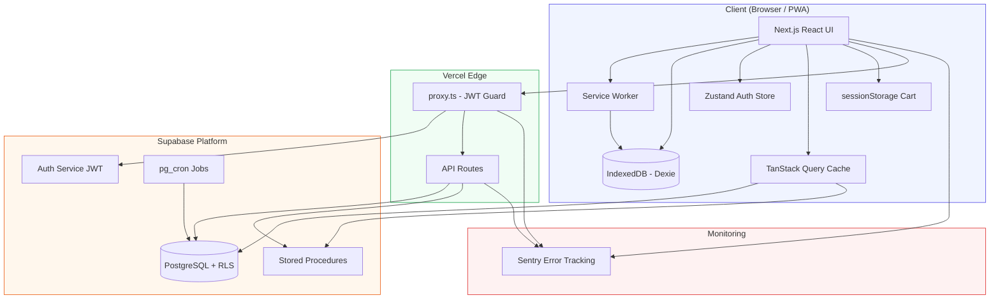

---

## 3. Frontend Architecture

### Component Architecture

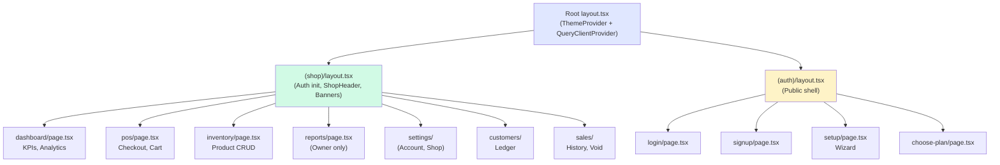

### State Architecture

```mermaid
graph LR
    subgraph Zustand["Zustand (authStore)"]
        US[user]
        PR[profile]
        SH[shop]
        SHS[shops array]
        RL[role]
        PL[planName]
    end

    subgraph TanStack["TanStack Query"]
        PROD[products]
        SALE[sales]
        CUST[customers]
        CATS[categories]
        TEAM[team members]
    end

    subgraph Dexie["Dexie IndexedDB"]
        IDB_PROD[products table]
        IDB_SALE[sales table]
        IDB_SQ[sync_queue table]
        IDB_CUST[customers table]
    end

    Zustand -->|provides shopId| TanStack
    TanStack -->|fallback on error| Dexie
    TanStack -->|seed on success| Dexie
    Dexie -->|replay on reconnect| Supabase[(Supabase)]
```

---

## 4. Backend Architecture

### Request Processing Pipeline

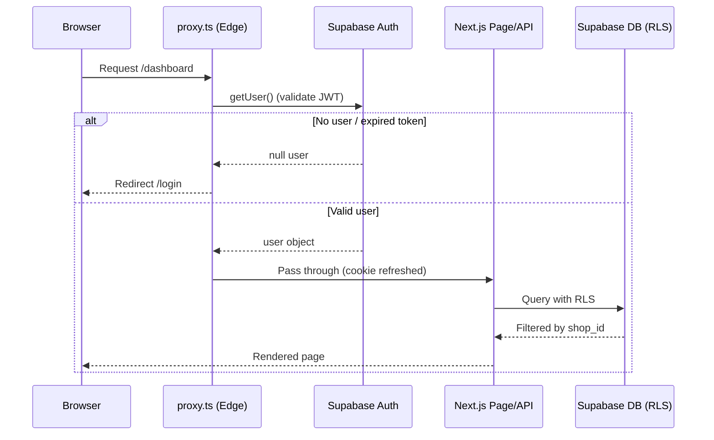

### RPC Architecture

All critical mutations go through Supabase RPCs that run as `SECURITY DEFINER`:

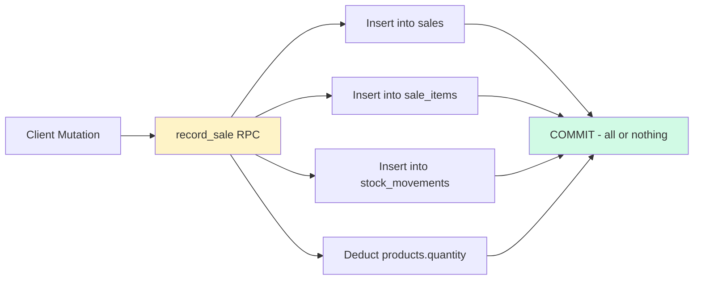

---

## 5. Database Architecture

### Migration Strategy

67 migrations tell the story of the product's evolution:

| Phase      | Migrations       | Key Changes                                                             |
| ---------- | ---------------- | ----------------------------------------------------------------------- |
| Foundation | 001–004          | Core schema, RLS, RPCs, multi-shop                                      |
| Security   | 005–012, 018–019 | Staff fixes, lockdowns, revoked writes                                  |
| Features   | 013–017          | Materialized views, usage limits, payment methods, delivery, customers  |
| Scale      | 020–029          | Invites, monitoring, audit, performance indexes                         |
| Product    | 030–043          | Staff CRUD, variants, audit trail, contact                              |
| Business   | 044–052          | Admin, soft deletes, subscriptions, plans, M-Pesa                       |
| Billing    | 053–064          | Ultra Pro, trials, cron sync, setup limits, shop deletion, auto-billing |
| Analytics  | 20260604…        | Product analytics RPC                                                   |

### RLS Architecture

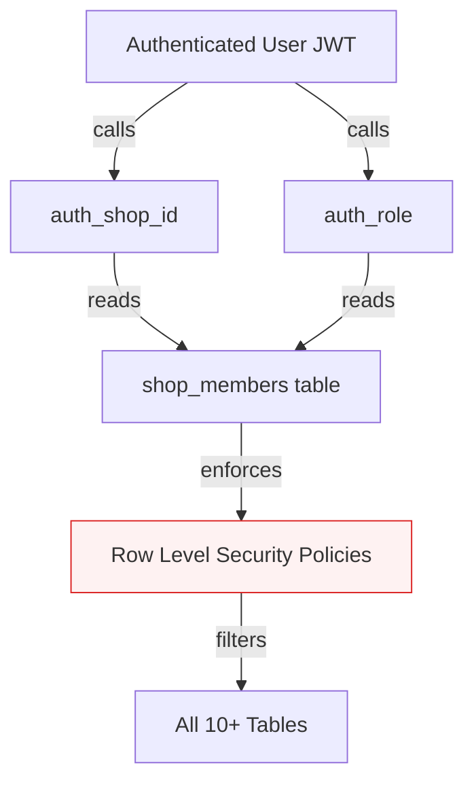

---

## 6. Database ERD

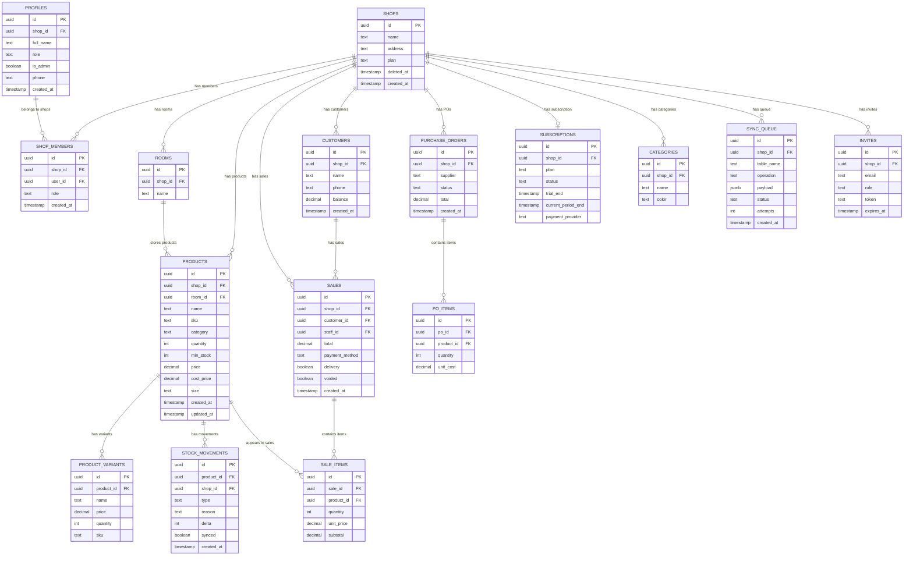

---

## 7. Authentication Architecture

### Token Lifecycle

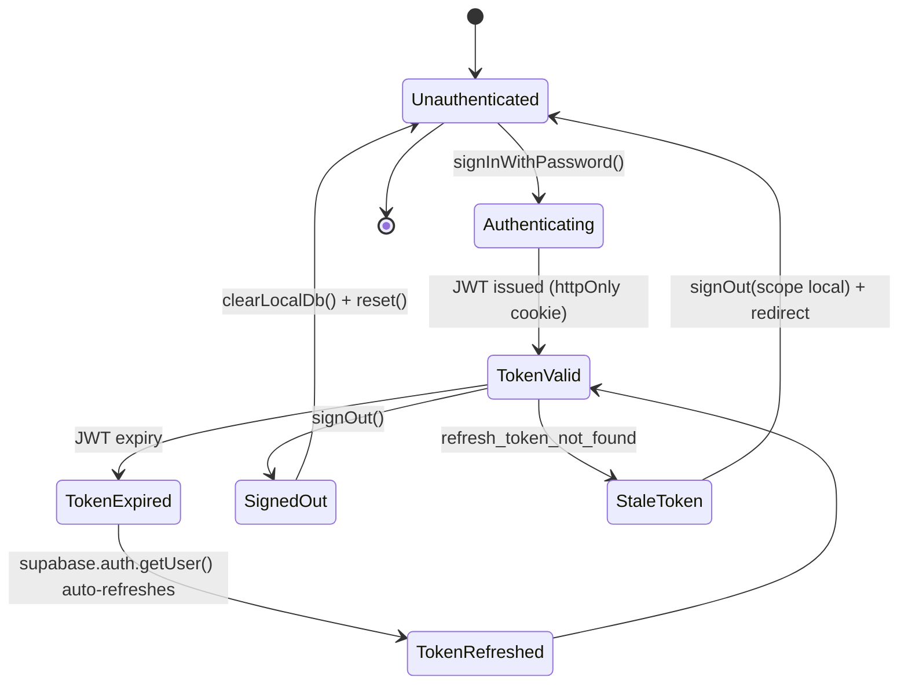

---

## 8. Authentication Flow Diagram

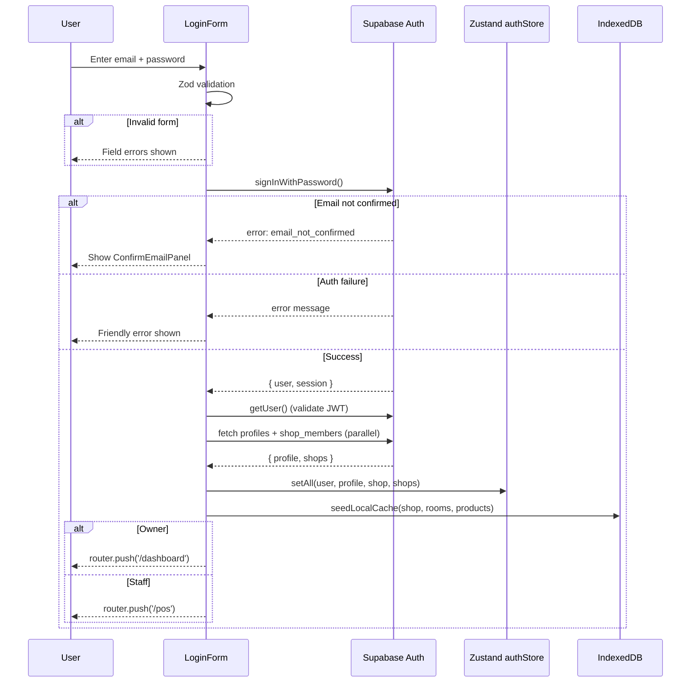

---

## 9. Authorization Architecture

### Permission Check Flow

```mermaid
flowchart TD
    Request[Incoming Request to /reports]
    Proxy[proxy.ts: getUser validates JWT]
    Layout[shop layout.tsx: init fetches profile + role]
    OwnerGuard[OwnerGuard component]
    RLS[Supabase RLS: auth_role check]

    Request --> Proxy
    Proxy -->|no user| Login[/login redirect]
    Proxy -->|valid user| Layout
    Layout -->|staff role| OwnerGuard
    OwnerGuard -->|not owner| Denied[Access Denied screen]
    OwnerGuard -->|is owner| RLS
    RLS -->|wrong shop_id| Empty[Empty result set]
    RLS -->|correct shop| Data[Data returned]
```

---

## 10. Offline Sync Architecture

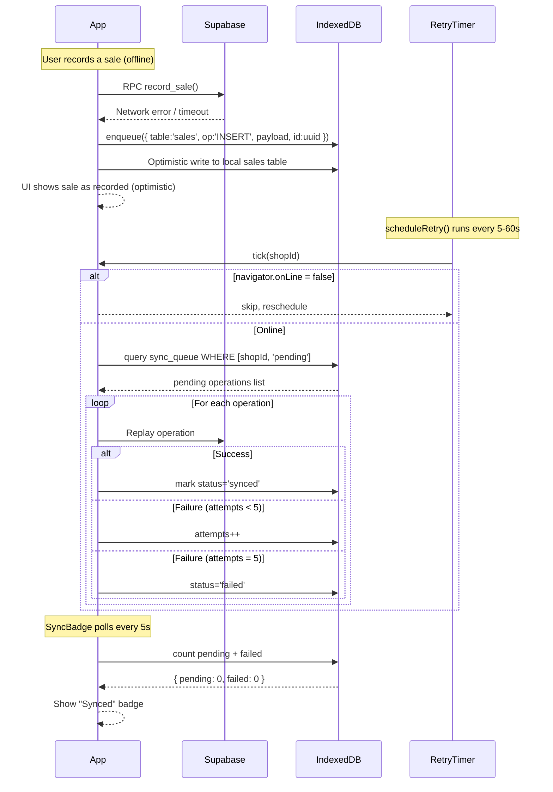

---

## 11. API Flow Diagram

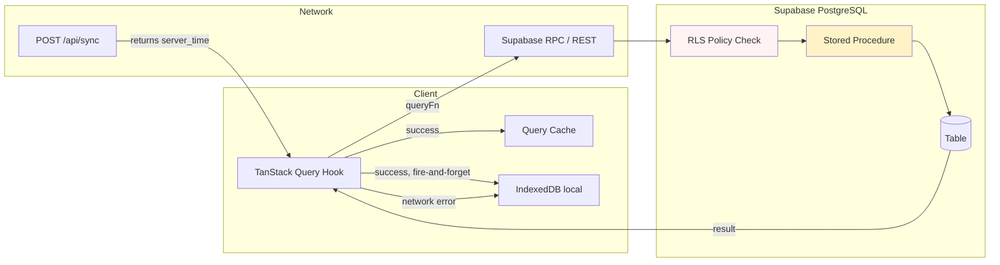

---

## 12. Subscription Architecture

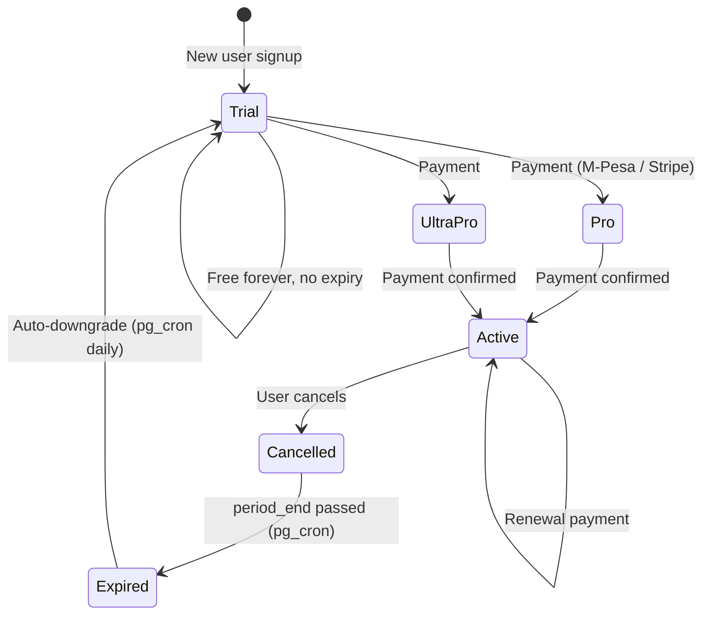

### Plan Limits Enforcement

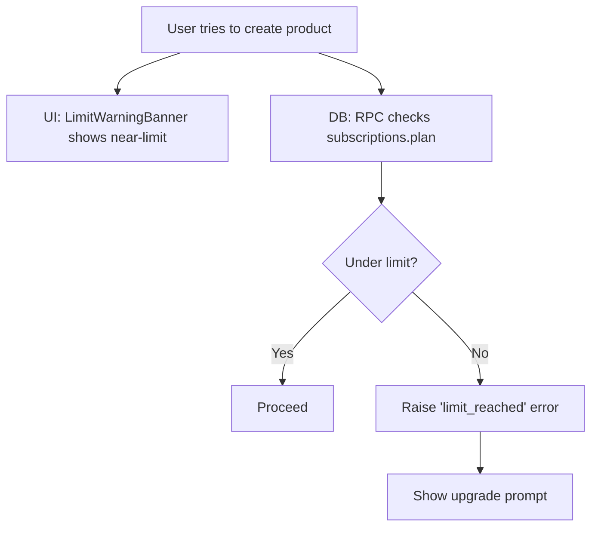

---

## 13. Payment Journey Diagram

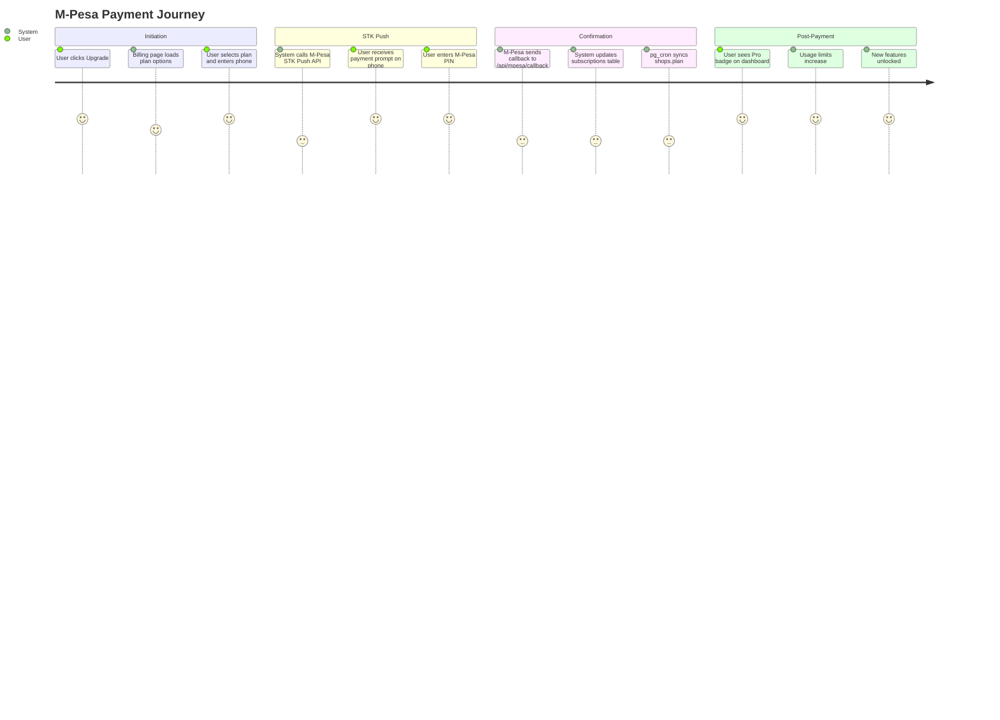

---

## 14. User Journey Diagram

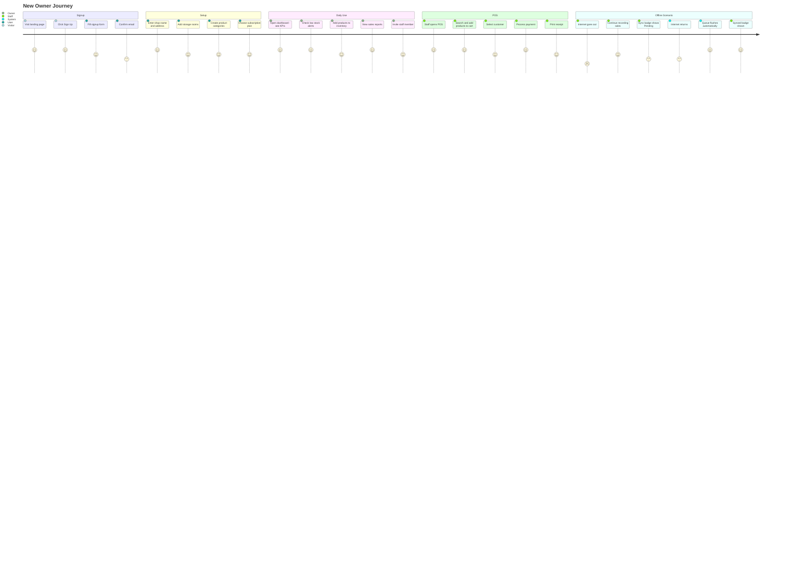

---

## 15. Admin Journey Diagram

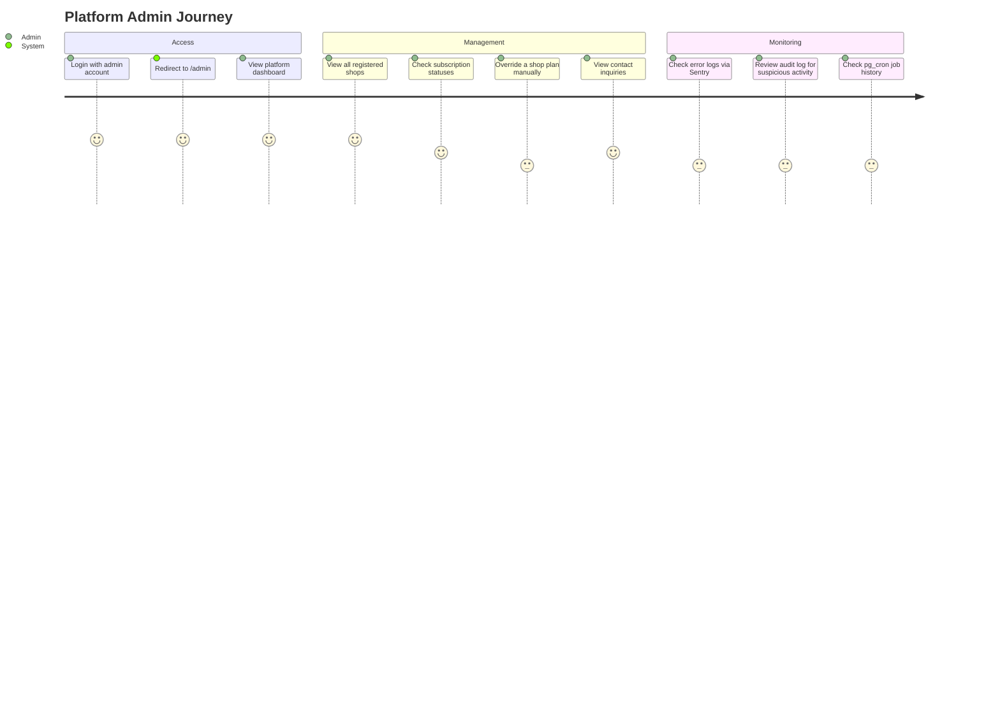

---

## 16. Deployment Architecture

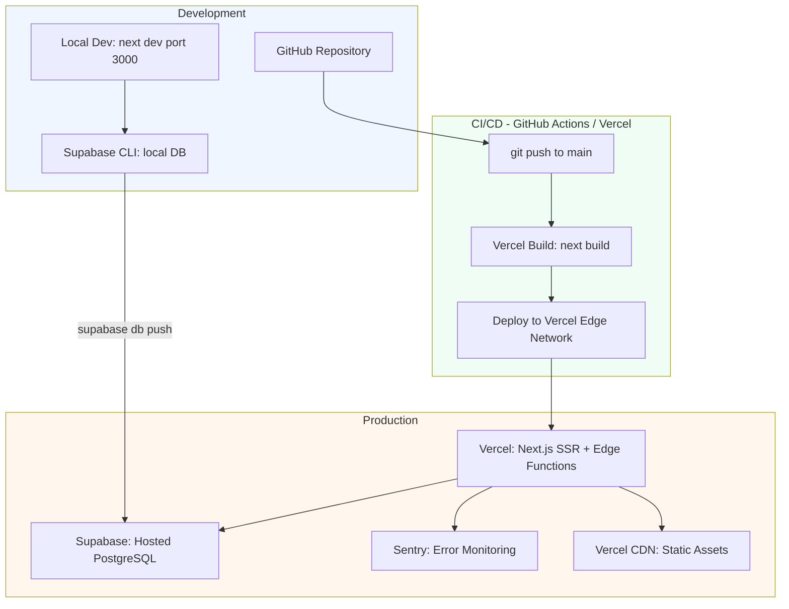

### Vercel Configuration (`vercel.json`)

- Function timeout: 30s for API routes
- Region: closest to Supabase instance
- SW file served with `Cache-Control: no-cache, no-store, must-revalidate`

### Database Migration Pipeline

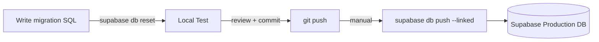

---

_End of Architecture Guide_
